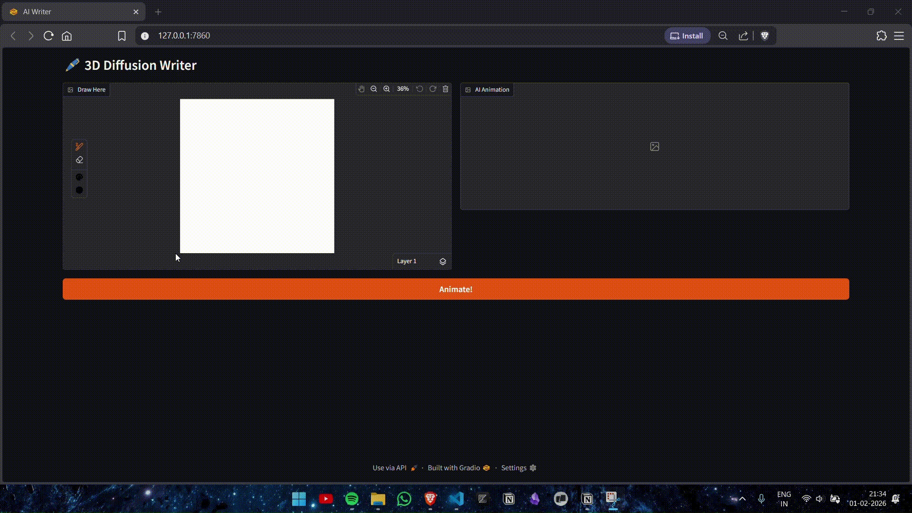

# Tiny Img-to-Vid

Tiny Img-to-Vid is a deep learning project that generates video sequences from static images using a 3D U-Net and diffusion models. The project is designed for research and experimentation with generative models, especially for tasks like animating MNIST digits or user-provided images.



## Features

- 3D U-Net architecture for spatiotemporal modeling
- Diffusion-based video generation
- Gradio web interface for easy demo and inference
- Preprocessing utilities for user images
- Example notebooks for training and experimentation

## Project Structure

```
├── app.py                  # Gradio app for interactive demo
├── src/                    # Source code (network, inference, preprocessing, training)
├── model/                  # Pretrained model weights
├── notebook/               # Jupyter notebooks for training and experiments
├── pyproject.toml          # Project dependencies and metadata
└── README.md               # Project documentation
```

## Installation

1. Clone the repository:
	```sh
	git clone https://github.com/Unica2804/Tiny_Diffusion.git
	cd Tiny_Diffusion
	```

2. (Recommended) Create and activate a virtual environment:
	```sh
	python3 -m venv .venv
	source .venv/bin/activate
	```

3. Install [uv](https://github.com/astral-sh/uv) (if not already installed):
	```sh
	pip install uv
	```

4. Install dependencies using uv:
	```sh
	uv pip install .
	```

## Usage

- **Run the Gradio app:**
  ```
  python app.py
  ```
  This will launch a web interface for generating videos from images.

- **Train or experiment:**
  See the notebooks in the `notebook/` directory for training and research workflows.

## Model

- The default model is a 3D U-Net trained on MNIST motion data.
- Pretrained weights are provided in `model/mnist_motion_3d_v3.pth`.


## Contributing

Contributions are welcome! Please open issues or pull requests for improvements or bug fixes.

## License

This project is licensed under the MIT License.